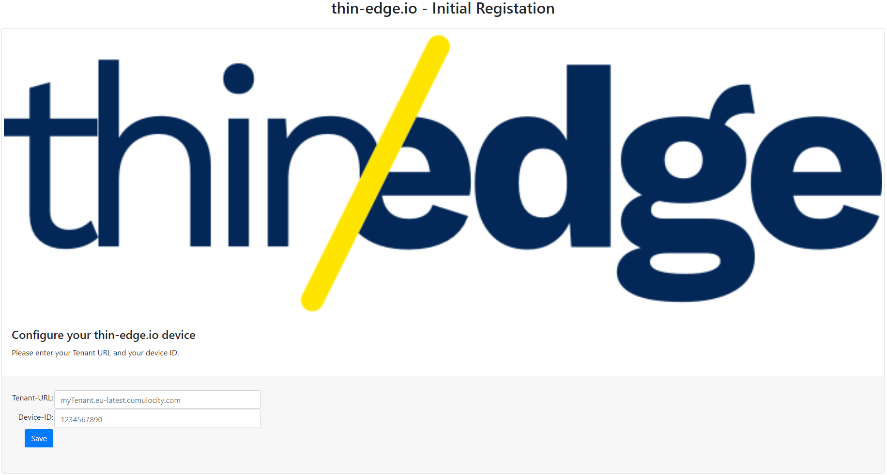
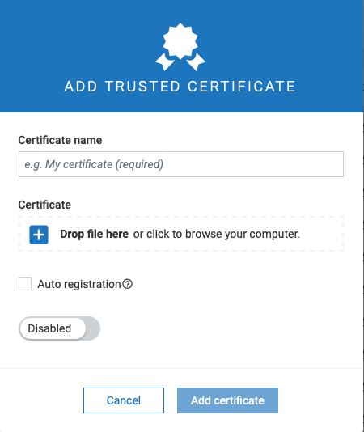

<!-- PROJECT LOGO -->
<br />
<p align="center">
  <a href="https://thin-edge.io">
    
  </a>

  <h3 align="center">dockerized thin-edge.io example application </h3>
  <p align="center"><a href="https://thin-edge.io">thin-edge.io</a></p>
  <br />
  <br />
</p>

<!-- TABLE OF CONTENTS -->
<details open="open">
  <summary>Table of Contents</summary>
  <ol>
    <li><a href="#about">About</a></li>
    <li><a href="#getting started">Getting Started</a></li>
    <li><a href="#usage">Usage</a></li>
    <li><a href="#license">License</a></li>
  </ol>
</details>

<br/>
<br/>

<!-- ABOUT -->
# About 

This project aims on leveraging thin-edge.io capabilities for building real world applications. It enables you to use thin-edge.io with an easy-to-use docker based deployment and no code commissioning process. 
<br/>
Additionally it extends thin-edge.io in the area of managing, visualizing and persisting data on the edge with the help of third party technologies like node-red, telegraf and influxdb.
<br/>
<br/>

<!-- GETTING STARTED -->

# Getting Started
1. Adapt Architecture: Within the current build the used architecture is hardcoded in 4 places and needs to be adapted to either amd64, armhf or arm64 within /tedge/Dockerfile
<br/>

2. Please ensure to use end of line character sequence "LF" within /tedge/start.sh file. When re-composing please also ensure to delte erything in /influx/config and /influx/data .
<br/><br/>

3. Compose the docker containers with following command:
<br/><br/> 
```docker-compose up```
<br/><br/>
If you did any changes inbetween please use:
<br/><br/>
```docker-compose up --build```
<br/><br/>

4. Now you should have a running docker application consisting of 4 containers.

<!-- USAGE -->
# Usage
## Device Registration in Cumulocity IoT
Open http://localhost:8080/home in a web browser. Fill in your tenant URL and desired Device ID and hit Save.
</br>
<p style="text-indent:30px;">
  <a href="http://localhost:8080/home">
    
  </a>
</p>
<br/>
Afterwards a pair of a self-signed private and public keys will be created. As soon as you see a Download button you can download the public key while the private key does not leave your device. Under {{your_tenant_url}}/apps/devicemanagement/index.html#/trusted-certificates you can upload the public key to your tenant. Please activate the checkbox Auto Registration and enable the Certificate.
<br/><br/>
<p style="text-indent:30px;">
  <a>
    
  </a>
</p>
<br/>
Now your device should show up within Cumulocity IoT and start sending metrics about your device. 
<br/>
<br/>

## Usage of Node-Red
The Node-Red service can be reached via the standard port 1880 on the localhost address of your device, e.g. http://localhost:1880
## Usage of Influx
Influx UI can be reached via http://localhost:8086 . You will find and be able to adapt your credentials within the docker-compose.yml. By default all data published on the local MQTT bus is persisted and can be visualized in an easy fashion.


<!-- CONTRIBUTING -->
# Contributing
Contributions are what make the open source community such an amazing place to learn, inspire, and create.
How you can contribute to thin-edge.io you can find in the [Contribution Guideline](CONTRIBUTING.md)

Any contributions you make are **greatly appreciated**.
<br/>
<br/>

<!-- LICENSE -->
# License

Distributed under the Apache 2.0 License. See [LICENSE](LICENSE.txt) for more information.
<br/>
<br/>
