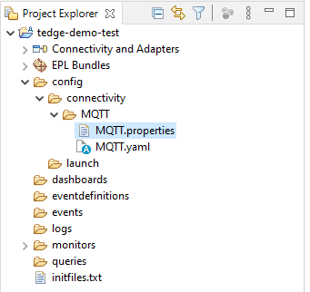
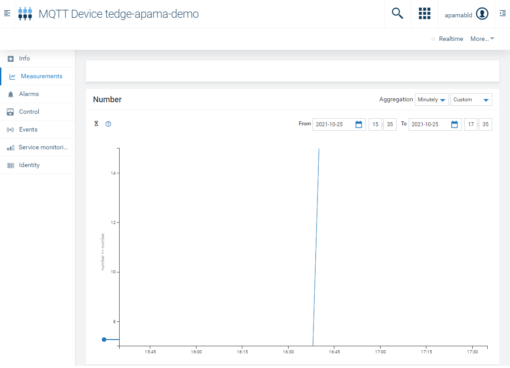

COPYRIGHT NOTICE

# Copyright (c) 2022 Software AG, Darmstadt, Germany and/or Software AG USA Inc., Reston, VA, USA, and/or its subsidiaries and/or its affiliates and/or their licensors.
# Use, reproduction, transfer, publication or disclosure is prohibited except as specifically provided for in your License Agreement with Software AG

# Using thin-edge.io with Apama Streaming Analytics
This file describes how to get started with Streaming Analytics on a thin-edge
device using Apama Community Core Edition.

## Prerequisites

- A Raspberry Pi (minimum version 3) running Raspberry Pi OS 32-bit. 
- thin-edge.io installed to the Raspberry Pi, which can be done by following the instructions in the
[thin-edge.io installation guide](https://github.com/thin-edge/thin-edge.io/blob/main/docs/src/howto-guides/002_installation.md).
- _Recommended:_ thin-edge.io configured with connection to Cumulocity IoT or Azure IoT Hub using the
[thin-edge.io connectivity instructions](https://github.com/thin-edge/thin-edge.io/blob/main/docs/src/howto-guides/004_connect.md).

### Optional

These are not essential to be able to run the examples provided. If you want to
modify or extend the examples or implement a real solution with Apama and
thin-edge.io we recommend you follow the guidance on creating, configuring and
deploying a project contained within this document.

- A full installation of [Apama Community Edition](https://apamacommunity.com/downloads/)
including Software AG Designer on a laptop or PC.
- Docker and the apama-builder and apama-correlator images. See the links below
for more details.
	- https://tech.forums.softwareag.com/t/apama-builder-for-docker/237796
	- https://hub.docker.com/_/softwareag-apama-builder
	- https://hub.docker.com/_/apama-correlator

## Setup and Configuration
### Installing Apama Community Core to the Raspberry Pi

The recommended way of installing support for Apama on thin-edge is by using the Debian based distributions apt package manager.

Further details about this can be found in the thin-edge.io documentation at [Manage the software on your devices from Cumulocity cloud](https://thin-edge.github.io/thin-edge.io/html/tutorials/software-management.html).

#### Set up the repository from which the packages will be installed
1. In the Cumulocity IoT tenant, open the **Device Management** app, go to the **Management** menu option and select the **Software repository**.
2. Click **Add software** at the right of the top menu bar. 
3. In the **ADD SOFTWARE** dialog enter the following details:
- **Software**: apama-repo
- **Description**: apama-repo (or something else if you choose)
- **Device Filter Type**: (leave empty)
- **Software Type**: apt
- **Version**: 2022::apt
- **SOFTWARE FILE**: check the Provide a file path option and enter the URL:	https://downloads.apamacommunity.com/debian/apama-repo_2022_all.deb

4. Click the **Add Software** button.
5. Now select the **Devices** menu option and then select **All devices**.
6. In the list of devices, select the thin-edge device installed previously.
7. In the sub-menu for the device, select the **Software** option.
8. Click the **Install software** button in the bottom left; the apama-repo should be listed.
9. Click the drop-down arrow on the right and check the 2022::apt radio button, then click **Install**.
10. Finally, click the **Apply changes** button in the lower right of the panel.


#### Add the Apama thin-edge support package to the tenant software repository and deploy it to thin-edge

1. Return to the **Device Management** app and go to the **Management** menu option and select the **Software repository**.
2. Click **Add software** at the right of the top menu bar. 
3. In the **ADD SOFTWARE** dialog enter the following details:
- **Software**: apama-thin-edge-support
- **Description**: apama-thin-edge-support (or something else if you choose)
- **Device Filter Type**: (leave empty)
- **Software Type**: apt
- **Version**: 10.15.0.2-1::apt
- **SOFTWARE FILE**: select the **Provide a file path** option and give an **empty space** (' ').
4. Click the **Add Software** button.
5. Now return to the **Devices** menu option and then select **All devices**.
6. In the list of devices, select the thin-edge device installed previously.
7. In the sub-menu for the device, select the **Software** option.
8. Click the **Install software** button in the bottom left; the apama-thin-edge-support should be listed.
9. Click the drop-down arrow on the right and check the 10.15.0.2-1::apt radio button, then click **Install**.
10. Finally, click the **Apply changes** button in the lower right of the panel.

Once Apama support has been installed, the correlator will attempt to start. However, it will initially fail because there is not yet an Apama project installed on the device. An Apama project can be deployed using the Cumulocity IoT tenant, as described below.


## Quick Start
For demonstration purposes a simple project has been provided with this repository which listens 
for events on the `demo/number` MQTT topic, increments the number by 1, and sends it back to the 
`tedge/measurements` topic.

### Deploying the project to thin-edge 

Zip the project located in the `StreamingAnalytics/src` directory of this repository. Note that you must use the zip format and not some other compression utility. Then use your tenant to deploy the zipped project to your thin-edge device by following these steps:


1. Return to the **Device Management** app and go to the **Management** menu option and select **Software repository**.
2. Click **Add software** at the right of the top menu bar. 
3. In the **ADD SOFTWARE** dialog enter the following details:
- **Software**: apama-quick-start
- **Description**: apama-quick-start (or something else if you choose)
- **Device Filter Type**: (leave empty)
- **Software Type**: apama
- **Version**: 1.0::apama
- **SOFTWARE FILE**: select the **Upload a binary** option and either drag and drop the project zip file created previously, or use the file chooser to navigate to it in your file system. 
4. Click the **Add software** button.
5. Now return to the **Devices** menu option and then select **All devices**.
6. In the list of devices, select the thin-edge device installed previously.
7. In the sub-menu for the device, select the **Software option**.
8. Click the **Install software** button in the bottom left; the apama-quick-start project should be listed.
9. Click the drop-down arrow on the right and check the 1.0::apama radio button. Then, click **Install**.
10. Finally, click the **Apply changes** button in the lower right of the panel.


## Creating a Software AG Designer Project
### Creating a New Project
- Open Software AG Designer on the laptop or PC and select a workspace (the default location is fine).
- Start a new project by choosing __File → New → Apama Project__.
- Give your project a name and then click __Next__.
- Add the MQTT connectivity plug-in from 'Connectivity bundles' and JSON support from 'Standard 
bundles' to the project and then click the __Finish__ button.

### Configuring MQTT Support
Open the `MQTT.properties` file.  This contains the configurations relating to the MQTT broker. 
thin-edge.io uses Mosquitto as the MQTT broker which runs on the same host as the Apama 
project.  The thin-edge.io Mosquitto broker is configured to not require SSL/TLS or password 
authentication for internal traffic. 

>In the Project Explorer tab, configuration files for MQTT can be found under __config → 
connectivity → MQTT__. 

The `MQTT_brokerURL` should be set as below:
```
MQTT_brokerURL=localhost
```
A full example of `MQTT.properties` can be found [here](src/quickstart/project/config/connectivity/MQTT/MQTT.properties).

>Unless manually configured otherwise, the thin-edge.io MQTT broker operates on the default 
port 1883.

Open the `MQTT.yaml` file.  This contains configuration relating to the chain which maps the MQTT 
messages to EPL events.

MQTT messages need to be mapped to EPL events in order to be able to use them within Apama.  The 
easiest way to do this for this purpose is using the 
[Classifier codec](https://www.apamacommunity.com/documents/10.11.0.1/apama_10.11.0.1_webhelp/apama-webhelp/#page/apama-webhelp%2Fco-ConApaAppToExtCom_classifier_codec.html%23wwconnect_header) 
which inspects incoming events on the transport and classify them, usually to an EPL event 
type, based upon their payload and metadata.  

An example `MQTT.yaml` file which contains the mapping for a single event with a single member can 
be found [here](src/quickstart/project/config/connectivity/MQTT/MQTT.yaml), more examples can be 
found within the other Streaming Analytics sample projects in this repository.

### Writing Apama Projects

The quick start example (see [Quick Start](#quick-start)) and the samples in this directory show 
some examples of EPL for some basic use cases.  The full EPL reference can be found 
[here](https://www.apamacommunity.com/documents/10.11.0.1/apama_10.11.0.1_webhelp/ApamaDoc/index.html).


### Deploying a Project
To deploy a project, use the `engine_deploy` utility provided with Apama.  Navigate to the 
workspace directory in a command prompt/terminal and run the following command in an `apama_env` 
prompt (see ['Setting up the environment using the Apama command prompt'](https://www.apamacommunity.com/documents/10.11.0.1/apama_10.11.0.1_webhelp/apama-webhelp/#page/apama-webhelp%2Fco-DepAndManApaApp_setting_up_the_environment_using_the_apama_command_prompt.html)):
```
engine_deploy --outputDeployDir project <project-src-dir>
```
Prior to uploading the project to your Cumulocity IoT tenant you must zip up the project folder. Note that you must use the zip format, and not some other compression utility. After doing this you can then upload the zip file to the tenant's software repository and then deploy it to the thin-edge device by following the instructions given above for the Quick Start project.


## Launching a Project
The project should be launched automatically on being deployed down to the thin-edge device.

>If you update or replace the project you should repeat the steps given above for deploying a project to thin-edge.

## Testing a Project
To publish messages to MQTT, thin-edge.io has a [built-in command](https://github.com/thin-edge/thin-edge.io/blob/main/docs/src/howto-guides/005_pub_sub.md).
You can publish/subscribe to any MQTT topic using this command, not just
thin-edge.io specific ones.  The messages should be valid [Thin Edge JSON](https://github.com/thin-edge/thin-edge.io/blob/main/docs/src/architecture/thin-edge-json.md)
format.

To test the quick start example, first open a terminal to subscribe to the `tedge/measurements` 
topic:

``` 
tedge mqtt sub tedge/measurements
```
In a separate terminal send some messages formatted like below:
```
tedge mqtt pub 'demo/number' '{ "number": 3 }'
```

The output numbers in the `tedge/measurements` topic should be the original test values 
incremented by 1.

If you followed the recommended prerequisite of connecting thin-edge.io to a
cloud provider such as Cumulocity IoT or Azure IoT Hub, any valid
(Thin Edge JSON) messages published to `tedge/measurements` also appear in the
device measurement interface.


