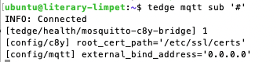

# Reader that published the content of the tedge.toml files via mqtt

For some reasons it would be good to have tedge.toml information available on dedicated mqtt topics.
Thus a watchdog was created that triggers a file read every time the tedge.toml is modified.

## Requirements

- Working thin-edge.io installation

- Python3 and pip3 installation (will not work on python2)


## Installation 

1. Clone this repo on the thin-edge.io device
2. run sudo -H pip3 install -r requirements.txt from this config2MQTT-watchdog directory
3. Copy reader.py to the following directory "/etc/tedge/"
4. OPTIONAL: Copy reader.service to the following directory "/lib/systemd/system/"

## Usage

If a daemon service such as systemd is used you can just start/enable the service via:

```shell
sudo systemctl start reader.service
sudo systemctl enable reader.service
```

That one will start the python script. You can also do that manually via:


```shell
python3 /etc/tedge/reader.py &
```

When ever there is a file change on the /etc/tedge/tedge.toml there will be send out retained messages on the topic 'config/{{SECTION}}'.

<br/><br/>
<p style="text-indent:30px;">
  <a>
  <center>
    
  </center>
  </a>
</p>
<br/>
