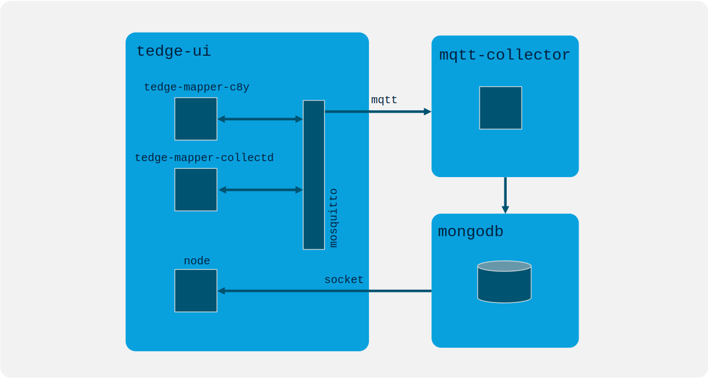
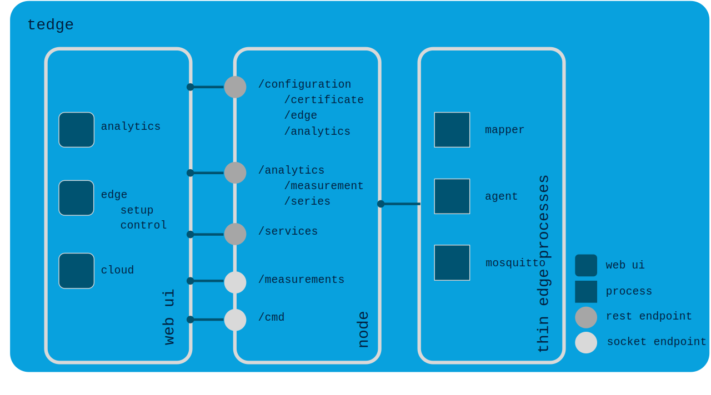
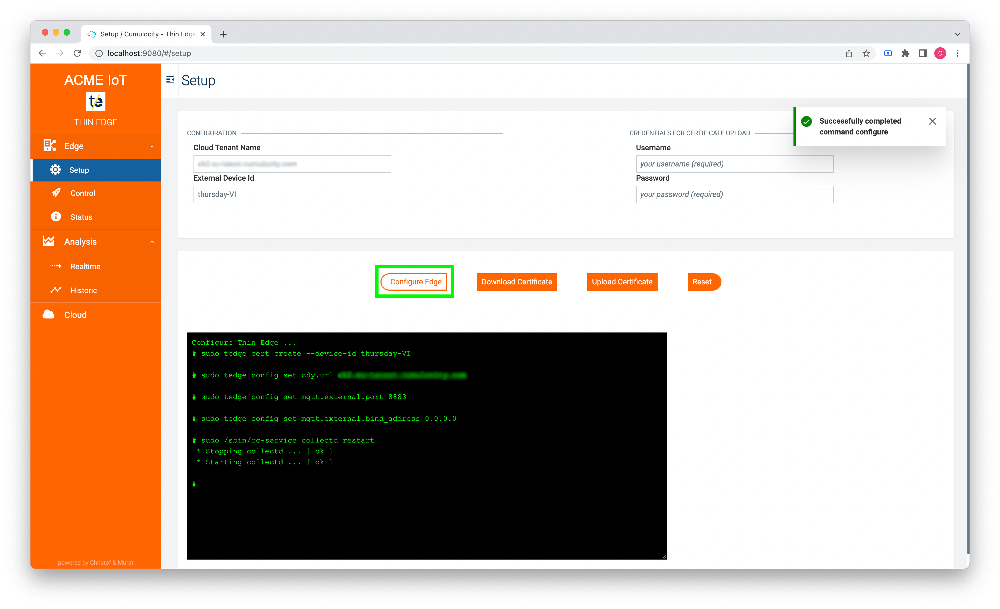
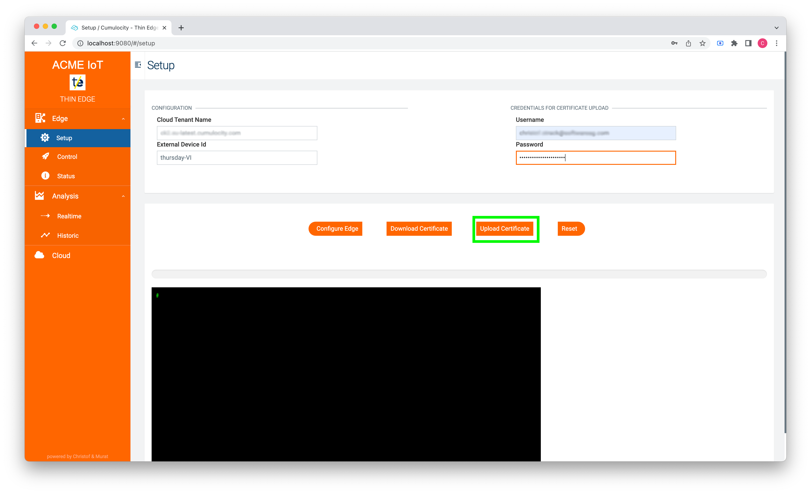
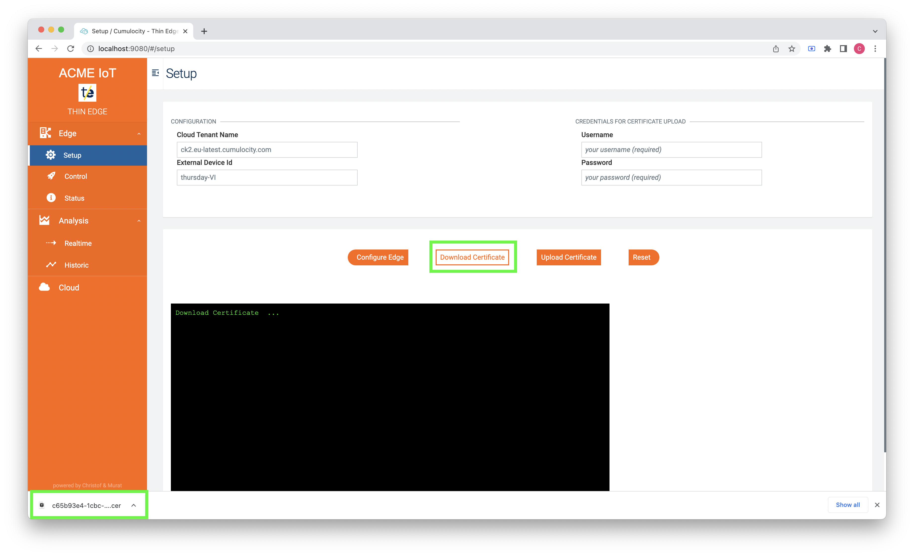
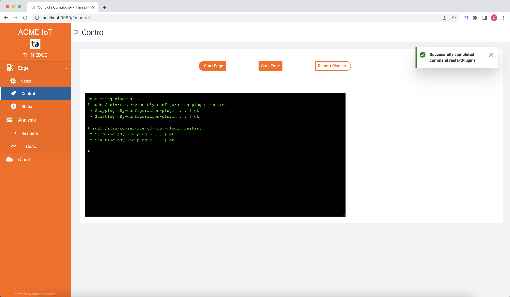
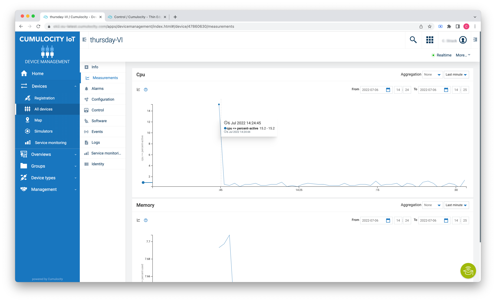
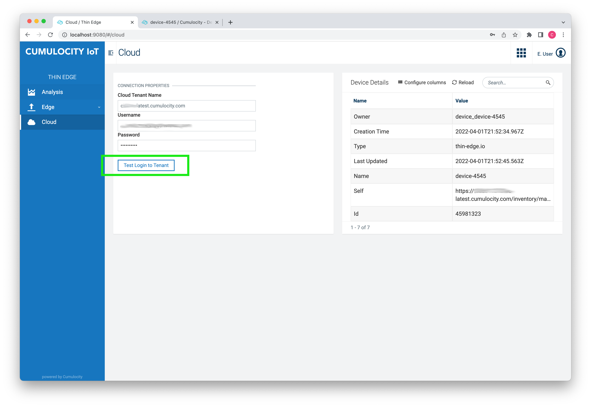
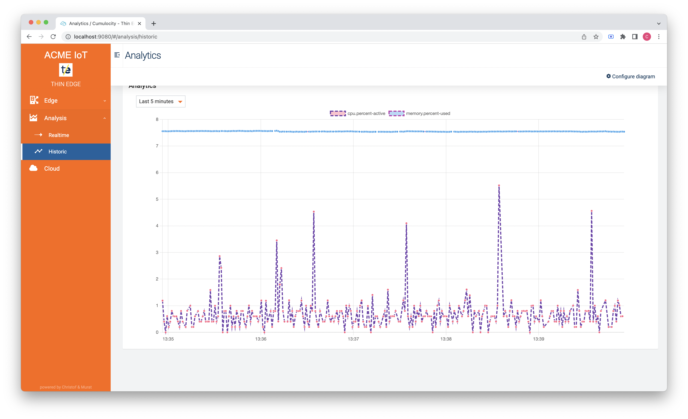
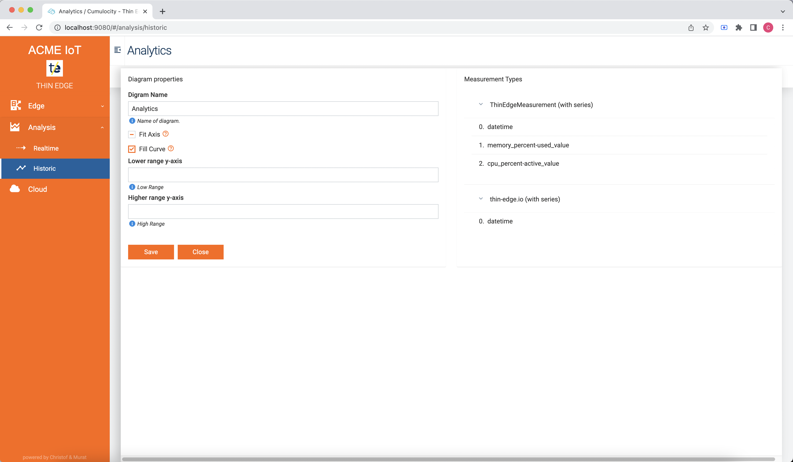

# Cumulocity thin-edge.io Management UI


This project adds an configuration ui to thin-edge.io. It enables you to use thin-edge.io with an easy-to-use docker based deployment and no code commissioning process. This helps to setup and monitor the edge using a web-ui:
* web-ui, for easy setup of the thin edge 
* simple line chart to view streamed data and to view historical data
* component to store measurements locally in a mongo db

# Content
- [Cumulocity thin-edge.io Management UI](#cumulocity-thin-edgeio-management-ui)
- [Content](#content)
- [Solution components](#solution-components)
- [Build thin edge binaries and run solution](#build-thin-edge-binaries-and-run-solution)
- [Configure thin edge in the web-ui](#configure-thin-edge-in-the-web-ui)
- [Contributing](#contributing)
- [License](#license)


# Solution components

This solution consists of 3 services:
* `tedge`: contain the thin edge core services: `tedge_agent`, `tedge_mapper`, ... and `tedge-ui` app
* `mqtt_colletctor`: listens to measurements on all topics of the mosquitto broker and sends them to the mongo db
* `mongodb`: stores the measurements in a colletion, to be retrieved by the web-ui. All measurements have time-to-live (TTL) of 300. This can be changed



The folowing diagram show how the components (`tedge-ui`, `node` backend, `tedge` processes) in the tedge service communicate:




# Build thin edge binaries and run solution

To build the docker solution run:
```
docker-compose up
```

# Configure thin edge in the web-ui

To access the web-ui open a web bowser at: http://localhost:9080/#/setup.\
Here you start the setup of the edge and enter external device id and your cumulocity tenant url.\

Then press configure to create a device certificate. This Will late be upladed to you cloud tenant. The thin edge uses th ecertificate for authentication:

This will generate a certificate. This has to be uploaded through the web-ui. As mentioned before, the certificate is uploaded to the cloud tenant.

Alternatively, you can download the certificate locally and upload it manually to your cloud tenant.

A detailed decription how to import your certificate can de found is [Cumulocity Adminstration Documentation](https://cumulocity.com/guides/users-guide/device-management/#managing-trusted-certificates) to your cumulocity cloud tenant.\
Download the certificate.\
When the certificate is uploaded you can start the edge. If everything went well the completion of the startup is acknowledged


The edge processes are started and the thin edge is registered in the cloud tenant


The registration to the cloud can be verified here as well:


Then you can access the analytics dashboard : http://localhost:9080/#/analytics



and change the settings of the chart:



# Contributing

Contributions are what make the open source community such an amazing place to learn, inspire, and create. How you can contribute to thin-edge.io you can find in the Contribution Guideline

Any contributions you make are greatly appreciated. 


# License

Distributed under the Apache 2.0 License. See LICENSE for more information. 