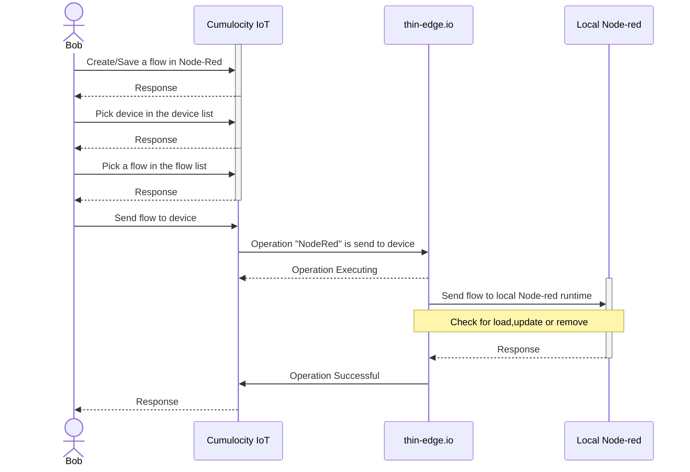
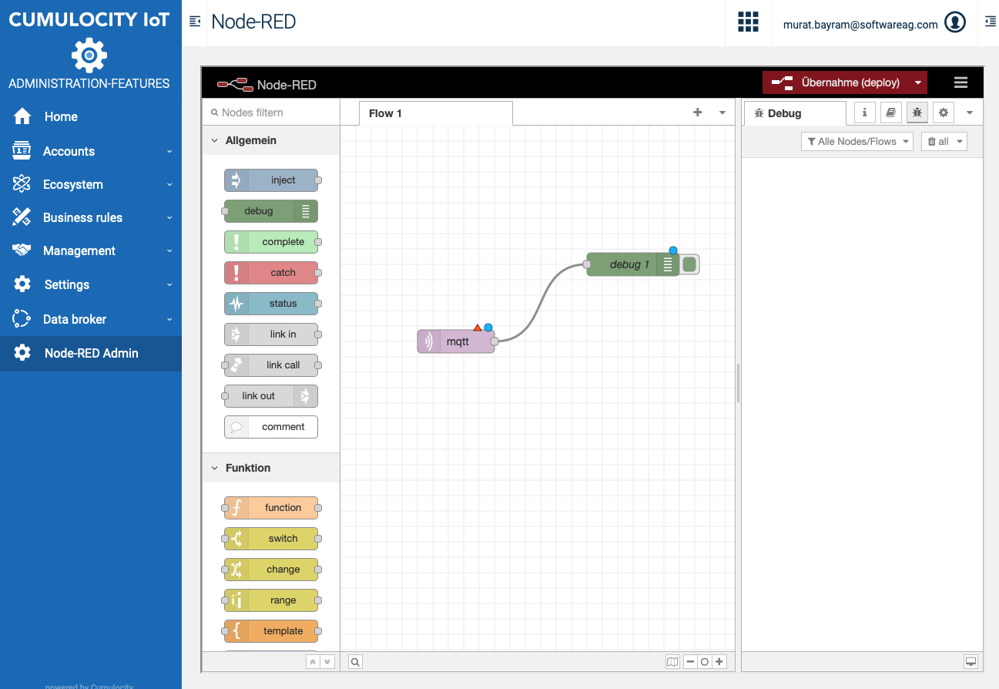
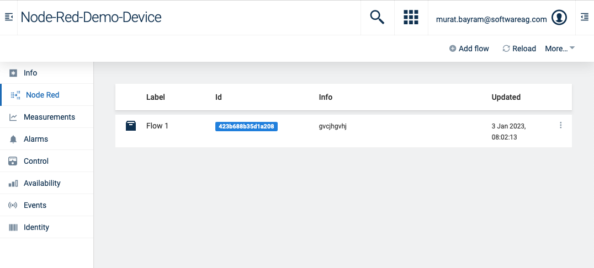
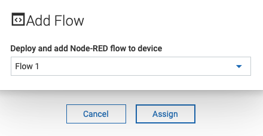
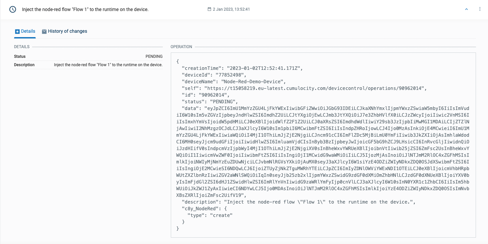
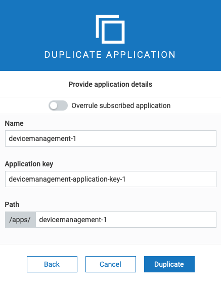
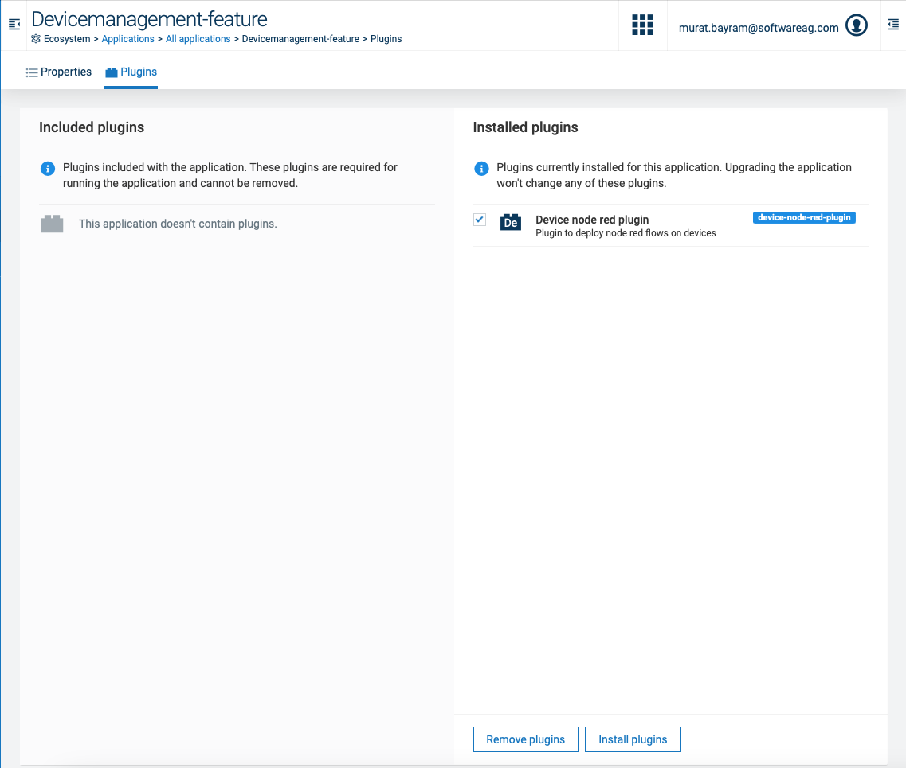
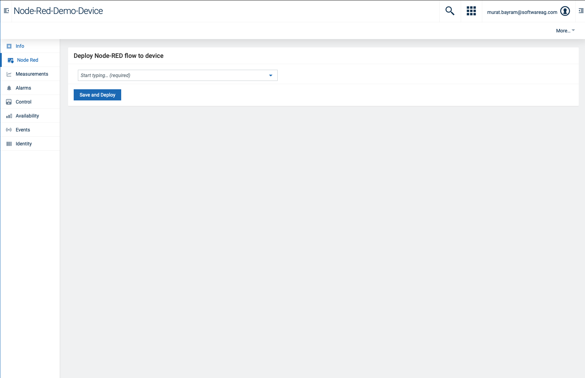
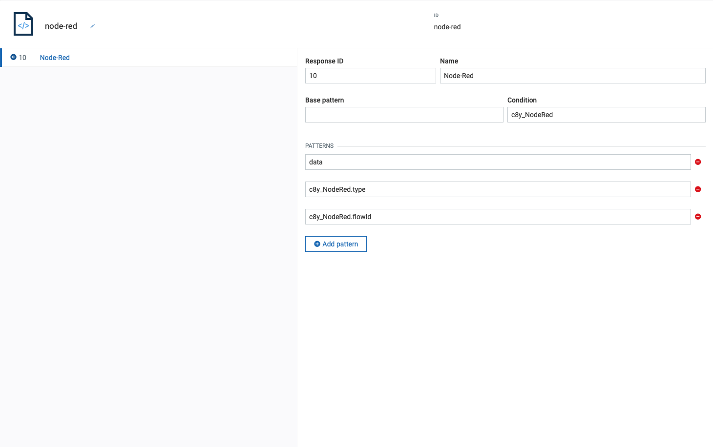

# Cumulocity - Manage Node-red flows with Cumulocity IoT and thin-edge.io

This repository contains the required parts to 

* To manage the distribution of flows to edge devices that are connected to Cumulocity IoT via thin-edge.io
* Inject the distributed flow into the local node-red runtime as a thin-edge.io plugin


Cumulocity IoT is a leading device management platform that provides a range of tools and services for managing IoT devices. It allows you to distribute your Node-RED flows across your edge devices and monitor them in real-time. You can also configure your devices remotely and access a wide range of analytics and reporting tools.

# Edge computing

Edge computing in the context of IoT refers to the processing and analysis of data from IoT devices at the edge of the network, rather than in a central cloud or data center. This allows for faster data processing and decision-making, as the data does not need to be transmitted over a network to a centralized location for processing.

One way to implement edge computing in an IoT system is through the use of Node-red, an open-source programming tool. By using Node-red locally, data can be processed and analyzed at the edge of the network, enabling real-time decision-making and reducing the reliance on a central cloud or data center.

Proper device management is essential in an IoT system that utilizes edge computing, as it ensures that the devices are functioning correctly and are able to transmit data to the edge for processing. This can be achieved through the use of tools such as device monitoring software, which alerts users to any issues with their devices and allows them to troubleshoot and fix problems in real-time.

# Cumulocity IoT - The leading device management platform

Cumulocity IoT is a leading device management platform that provides a range of tools and services for managing IoT devices. It allows you to monitor your devices in real-time, configure them remotely, and access a wide range of analytics and reporting tools.

With Cumulocity IoT, you can:

* Monitor your devices in real-time and receive alerts when something goes wrong
* Configure your devices remotely and apply updates or patches as needed
* Use APIs and integrations to connect your devices to other platforms and systems
* Benefit from a range of security features, including secure communication, authentication, and access control
* Cumulocity IoT is designed to be scalable and flexible, whether you are managing a few hundred devices or a few million.

# thin-edge.io - The open source framework

thin-edge.io is a lightweight open source framework that is designed specifically for IoT devices. It is build to be fast, secure, and easy to use, making it a great choice for device management.

One of the key benefits of thin-edge.io is its compatibility with Cumulocity IoT, the leading device management platform. By using thin-edge.io on your devices, you can take full advantage of the tools and services provided by Cumulocity IoT, including real-time monitoring, remote configuration, software management and analytics.

With thin-edge.io and Cumulocity IoT, you can:

* Easily install and monitor software on your edge devices
* Connect your devices to cloud platforms like Cumulocity IoT, Azure IoT and AWS IoT
* Configure devices
* Collect data locally and monitor them

# Node-Red

Node-RED is a visual programming tool that allows you to build and deploy IoT applications quickly and easily. It is particularly useful for edge computing, as it allows devices to process data locally and make real-time decisions. In that context Node-RED can be used to build flows that run on edge devices and process data locally. This can improve the performance and reliability of IoT systems, especially in situations where internet connectivity is limited.

# HowTo

To use this repo after installation of all components there is the following workflow:



## Create flow

First of all a flow needs to be defined within Cumulocity IoT Node-red. Make sure the flow is deployed to the platform side node-red runtime.

<br/><br/>
<p style="text-indent:30px;">
  <a>
  <center>
    
  </center>
  </a>
</p>
<br/>

## Pick Device

A device that has properly installed the thin-edge.io node-red plugin shows the Node-Red tab.

<br/><br/>
<p style="text-indent:30px;">
  <a>
  <center>
    
  </center>
  </a>
</p>
<br/>

In that tab you can select a flow that should be send to the device.

<br/><br/>
<p style="text-indent:30px;">
  <a>
  <center>
    
  </center>
  </a>
</p>
<br/>

In case that the flow was already send and was just updated/adjusted on platform side it will already appear in the list and can be updated via the context menu.

<br/><br/>
<p style="text-indent:30px;">
  <a>
  <center>
    
  </center>
  </a>
</p>
<br/>

The operation that is created contains the flow in base64 encoded. The thin-edge.io plugin handles the data according to the operation type such as e.g. remove, create or update.

<br/><br/>
<p style="text-indent:30px;">
  <a>
  <center>
    
  </center>
  </a>
</p>
<br/>


# Installation

This repository consists of several parts that need to be up an running:

* Node-Red locally on the device
* The Node-Red UI/Backend on Cumulocity
* The device management plugin that allows management and distribution of the node-red flows
* thin-edge.io plugin to inject or delete the flows in the local node-red runtime


## Node-red

There are several ways on how to run node-red locally on the device. However basically only two methods are mentioned here:

### Native installation via npm

Make sure that you have npm installed on your system. npm is typically installed automatically with Node.js, so if you have Node.js installed, you should already have npm. 
You can check if npm is installed by running the following command in your terminal:

```bash
npm -v
```

If npm is not installed, you can install it by following the instructions on the npm website (https://www.npmjs.com/get-npm). Once npm is installed, you can install Node-RED by running the following command in your terminal:

```bash
npm install -g node-red
```

This will install the latest version of Node-RED and make it available globally on your system.

To start the Node-RED server, run the following command in your terminal:

```bash
node-red
```

This will start the Node-RED server. Usually the web server can be reached via port 1880.

### Running via docker

Make sure docker is installed on your system. You can download Docker from the official website (https://www.docker.com/products/docker-desktop).

Start the Docker daemon by running the following command:

```bash
sudo systemctl start docker
```

Once the Docker daemon is running, pull the latest Node-RED image from the Docker registry by running the following command:

```bash 
docker pull nodered/node-red
```

Run the Node-RED container by executing the following command:

```bash
docker run -d -p 1880:1880 --name mynodered nodered/node-red
```

This command will start the Node-RED container in detached mode (-d), bind the container's port 1880 to the host's port 1880 (-p 1880:1880), and give the container the name "mynodered".

This will start the Node-RED server in a container. Depending on your mapping (-p) the web server can be reached via port 1880 or any other you configured.
## Node-red UI plugin

Referring to the backend/frontend implementation you can find all content, packages and tutorials here:

https://github.com/SoftwareAG/cumulocity-node-red

## Node-red device management plugin

You need to install the plugin for the device management application to your Cumulocity IoT Tenant:

The plugin is provided as binaries in [Releases](https://github.com/SoftwareAG/url/releases) or in the "node-red-devicemanagement-plugin" directory.

To install the plugin go to the Administration App -> Ecosystem -> Packages and click on "Add Application" on the top right.

> **_NOTE:_** If you don't see the Packages Menu you have to add "?beta=true" in your URL.
> Example: {{url}}/apps/administration?beta=true

Select the binaries and wait until it is uploaded.

> **_NOTE:_** We need to clone the Device Management app to add the plugin to it

After successful upload go to "All Applications" and click on "Add Application". Select "Duplicate existing application"
and afterwards "Device Management".

<br/><br/>
<p style="text-indent:30px;">
  <a>
  <center>
    
  </center>
  </a>
</p>
<br/>


Now select the cloned Device Management App and go to the "Plugin" Tab. Click on "Install Plugin" and select "node-red-management plugin"

<br/><br/>
<p style="text-indent:30px;">
  <a>
  <center>
    
  </center>
  </a>
</p>
<br/>


### thin-edge.io

To install thin-edge.io locally on a device just follow the following tutorial:

https://thin-edge.github.io/thin-edge.io/html/tutorials/getting-started.html#Step-1-Install-thin-edge.io


The basic steps are:

1. Get thin-edge.io installation script using the [official instructions](https://thin-edge.github.io/thin-edge.io/install/)

2. Set the Cumulocity IoT tenant url

```bash
sudo tedge config set c8y.url {{YOUR_C8Y_URL}}
```

3. Create/Upload Certificate

```bash
sudo tedge cert create --device-id {{YOUR_UNIQUE_DEVICE_ID}}
```

4. Connect

```bash
sudo tedge connect c8y
```

## thin-edge.io plugin

To inject node-red flows via operation from Cumulocity IoT the operation plugin concept is used. The tedge_agent is checking for specific operations and is triggering the particular plugin. Therefore the plugin needs to be proper installed.

### Requirements

- Working thin-edge.io installation

- Python3 and pip3 installation (will not work on python2)

### node-red thin-edge.io plugin

1. Clone the content of the directory "node-red-devicemanagement-plugin on the thin-edge.io device
2. run sudo -H pip3 install -r requirements.txt from that directory
3. Copy c8y_NodeRed to the following directory "/etc/tedge/operations/c8y/"
4. Copy c8y_NodeRed.py to the following directory "/bin/"
5. Copy api.py to the following directory "/bin/"
6. Make sure, that both files do have permissions for being executed by tedge_mapper ("chmod 644 c8y_NodeRed and chmod 555 c8y_NodeRed.py and api.py")


You device within Cumulocity should look similar to this afterwards:

<br/><br/>
<p style="text-indent:30px;">
  <a>
  <center>
    
  </center>
  </a>
</p>
<br/>

### SmartRest template

SmartRest is a csv format that converts RestAPI interactions on Cumulocity IoT to a comma separated payload on mqtt.

<br/><br/>
<p style="text-indent:30px;">
  <a>
  <center>
    
  </center>
  </a>
</p>
<br/>

Find more to SmartRest in the [documentation](https://cumulocity.com/guides/reference/smartrest-two/).
There is also a SmartRest template (node-red.json) here in this repository that can easily be imported.

# Limitations

Currently there is no monitoring of the edge sided events in the Cumulocity IoT platform. In a next steps the repository parts will be extended thus one can monitor what's happening on the local device side via the debug node within node-red. There is also currently no logic implemented for custom installed nodes. These need to be installed either manually or via configuration management of Cumulocity IoT.

# Copyright

````
Copyright (c) 2022 Software AG, Darmstadt, Germany and/or Software AG USA Inc., Reston, VA, USA,
and/or its subsidiaries and/or its affiliates and/or their licensors.

SPDX-License-Identifier: Apache-2.0

Licensed under the Apache License, Version 2.0 (the "License");
you may not use this file except in compliance with the License.
You may obtain a copy of the License at

     http://www.apache.org/licenses/LICENSE-2.0

Unless required by applicable law or agreed to in writing, software
distributed under the License is distributed on an "AS IS" BASIS,
WITHOUT WARRANTIES OR CONDITIONS OF ANY KIND, either express or implied.
See the License for the specific language governing permissions and
limitations under the License.

````


These tools are provided as-is and without warranty or support. They do not constitute part of the Software AG product suite. Users are free to use, fork and modify them, subject to the license agreement. While Software AG welcomes contributions, we cannot guarantee to include every contribution in the master project.

For more information you can Ask a Question in the [TECH Community Forums](https://tech.forums.softwareag.com/tag/Cumulocity-IoT).

Contact us at [TECHcommunity](mailto:Communities@softwareag.com?subject=Github/SoftwareAG) if you have any questions.
