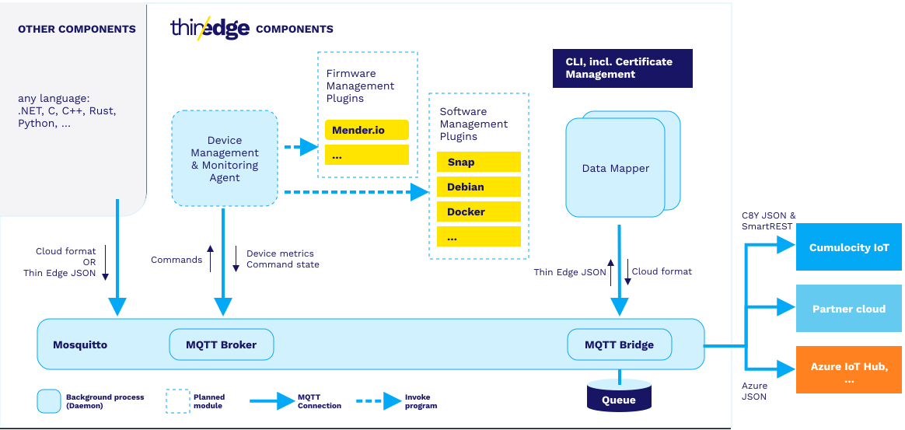
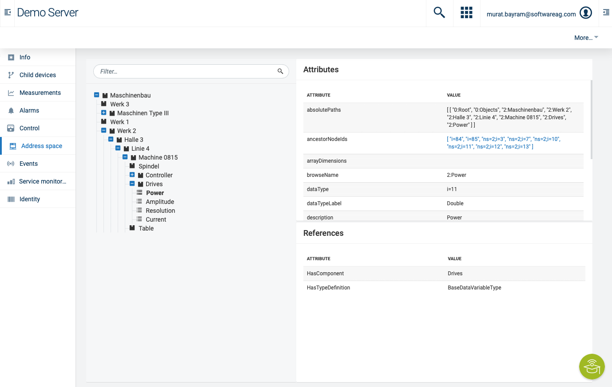
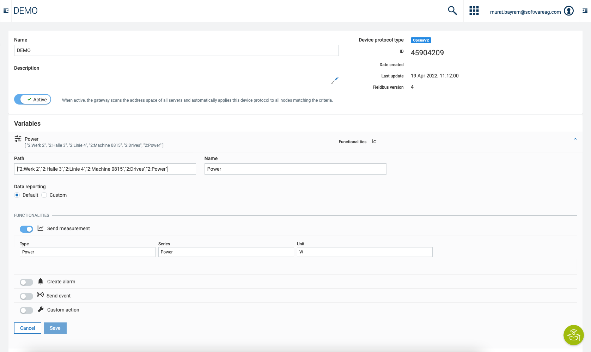
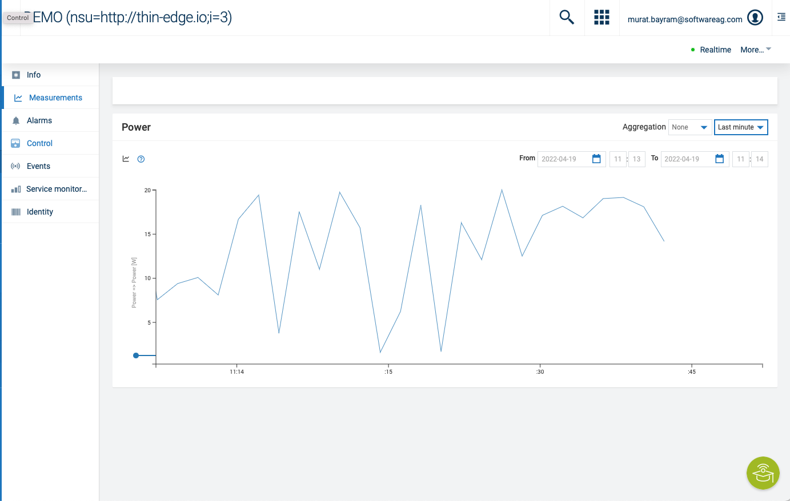

# Thin-edge.io and OPC UA Gateway Agent

This solution combines thin-edge.io and the OPC UA Gateway Agent together with a sample OPC UA Server.

See as well for additional information: 

[OPC UA Agent Cumulocity](https://cumulocity.com/guides/protocol-integration/opcua/)

[thin-edge.io](https://thin-edge.io)


The architecture allows that other components can be used on thin-edge.io. This is possible due to the concepct of using mqtt as the underlying messaging broker. The module can be programmed in any language but needs to understand mqtt and its payload/topic structure.

However thats where a modified version of the OPC UA Gateway agent can be used. In this solution the steps to create that solution as well as the underlying idea are described.

<br/>
<p style="text-indent:30px;">
  <a>
  <center>
    
  </center>
  </a>
</p>
<br/>

# Quickstart

```bash
git clone https://github.com/thin-edge/thin-edge.io_examples
cd thin_edge.io_examples/opcua-solution
```

Modify the values within the .env file. Make espacially sure that you have an proper device ID for thin-edge.io. The baseUrl should be without leading https://.

```bash
docker-compose up -d
```

As soon as thin-edge.io is started, log into that container via

```bash
docker exec -it thin-edge.io sh
```

You have to upload the created device certificate. You can do that via:

```bash
tedge cert upload c8y --user {YOURUSERNAME}
```

Enter your password and the certificate will be updated. Connect thin-edge.io via:

```bash
sudo tedge connect c8y
```

The device will appear in the device list, the opcua gateway agent will be a child device of this device.

<br/>
<p style="text-indent:30px;">
  <a>
  <center>
    
  </center>
  </a>
</p>
<br/>

Until the device is not proper connected and the MQTT broker is not running proper, the OPC UA Gateway Agent will fail to start. You need to start that again after the proper connect of thin-edge.io to cumulocity.
# thin-edge.io

Thin-edge.io is here deploayed as a docker container on the basis of an alpine image. Feel free to adjust. Some steps are already packed into the building process such as creating the device certificate based on the device id. The uploading of the certificate needs to be handled manually via

```bash
tedge cert upload c8y --user
```

However if you use your own certificate this step can be ignored but you need to copy your certificate into /etc/tedge/device-certs while building.
## dockerfile content

```docker
  tedge:
    build:
      context: ./tedge
      args:
        - URL=${baseUrl}
        - DEVICEID=${deviceID}
    container_name: thin-edge.io
    env_file:
      - .env
    volumes:
    - /var/run/docker.sock:/var/run/docker.sock
    restart: on-failure 
```
# OPC Simulation Server

The Simulation Server simulates a machine within a factory. Values are updated every 2s.

<br/>
<p style="text-indent:30px;">
  <a>
  <center>
    
  </center>
  </a>
</p>
<br/>

You can change the tree before building the container.

Once the gateway scanned the OPCTree you can view its content within the device management and the corresponding device.

## dockerfile content

```docker
  opcserver:
      build:
        context: ./opcserver
      ports:
        - "4841:4840"
      expose:
        - "4841"
      container_name: opc-simulation
      restart: on-failure 
```

# OPC UA Gateway

The device representation of the OPC UA Gateway is a child-device for the thin-edge.io parent device. The agent is currently in BETA and not meant for productive usage.

To connect to the simulation OPC UA server enter url opc.tcp://opcserver:4840 or the url of the real OPC UA Server.

<br/>
<p style="text-indent:30px;">
  <a>
  <center>
    
  </center>
  </a>
</p>
<br/>

You can define which data points are translated in the device protocol section of cumulocity.

<br/>
<p style="text-indent:30px;">
  <a>
  <center>
    
  </center>
  </a>
</p>
<br/>

You can find more about the OPC UA Gateway implementation in the official [documentation](https://cumulocity.com/guides/protocol-integration/opcua/).

For the device protocoll a new device as child device of the OPC UA Server will be registered. The mapped measurements can be found there.

<br/>
<p style="text-indent:30px;">
  <a>
  <center>
    
  </center>
  </a>
</p>
<br/>

Until the device is not proper connected and the MQTT broker is not running proper, the OPC UA Gateway Agent will fail to start. 
## dockerfile content

Within docker-compose the part of gateway defines the parameters for the OPC UA Gateway agent. The

```docker
  gateway:
      build:
        context: ./gateway
      container_name: opc-gateway
      restart: always 
      env_file:
        - .env
      depends_on:
        - tedge
      volumes:
      - ./data/opcua/:/data
```

The registration data are stored in the ./data directory that are mapped as a volume to the docker service gateway.
