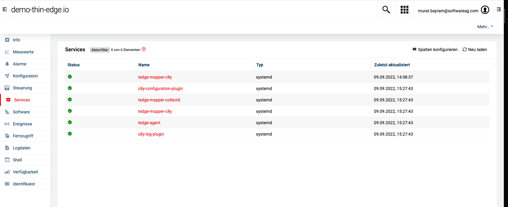

#  thin-edge.io Command plugin

With Cumulocity 10.14 devices can now announce their services.This component is used to map the internal watchdog endpoint to the SmartRest template of that newly introduced feature.

## Requirements

- Working thin-edge.io installation

- Python3 and pip3 installation (will not work on python2)

- watchdog configured for services (https://medium.com/thin-edge-io/monitor-and-maintain-the-health-of-your-devices-with-thin-edge-io-release-0-7-58c4dda95f1c)


## Installation 

1. Clone this repo on the thin-edge.io device
2. run sudo -H pip3 install -r requirements.txt from this directory
3. Copy watcher.py to the following directory "/etc/tedge/plugins"
4. OPTIONAL: Copy watchdog-service-mapper.service to the following directory "/lib/systemd/system/"
5. Make sure, the python file does have permissions for beeing executed by tedge_mapper ("chmod 555")


## Usage

Make sure thin-edge.io is connected to Cumulocity.
If installation is done properly according to the steps above, you just need to start the watcher.service via

```shell
sudo systemctl start watchdog-service-mapper.service
```

If you want the service to startup automatically you can do so via:

```shell
sudo systemctl enable watchdog-service-mapper.service
```

You device within Cumulocity should look similar to this afterwards:


<br/><br/>
<p style="text-indent:30px;">
  <a>
  <center>
    
  </center>
  </a>
</p>
<br/>